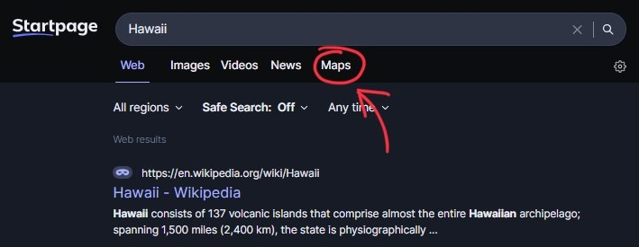

## ⚠️ Important Notice
#### This repository will no longer receive updates. The Startpage search engine now has a built-in maps option, making this extension obsolete.
---
<h1 align="center">

Startpage Maps Extension
</h1>

Startpage Maps is a browser extension that adds an Apple Maps tab to the Startpage search result page.

## Installation
This extension is not available in any browser extension store, but you can add it to your browser as an unpacked extension.

To do so, follow these three steps:

1. Download the latest [release](https://github.com/maxmmueller/startpage-maps/releases/latest) (source code zip) and unzip it
2. Enable the developer mode in your Chromium Browser
3. Click on "Load unpacked" and select the "src" folder of the downloaded repository

## Licence
Maximilian Müller 2023 [Apache License 2.0](LICENSE)
